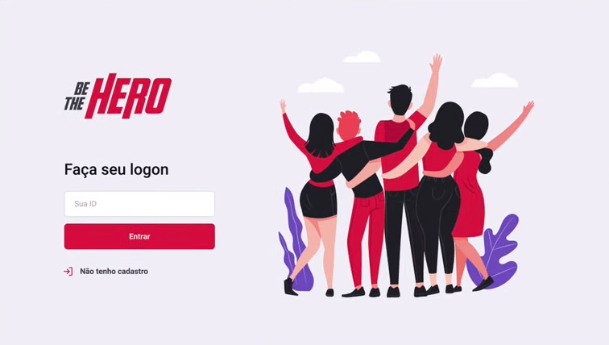

# Semana OmniStack11 by [Rocketseat](https://github.com/Rocketseat)

<p align="center">
  
</p>

> Aplicação que liga pessoas com vontade de ajudar __financeiramente__ organizações não governamentais (ONGs) <br>

#### O Projeto
<p align="justify">
Como existem ONGs com baixa visibilidade, a [Rocketseat](https://github.com/Rocketseat) propoem
uma ideia social para esta versão da OmniStack11 que é tornar cada vez mais acessivel o conhecimento
sobre as ONGs existentes, seja no bairro, cidade, estado ou país. Possíbilitando a interação entre
pessoas comuns e as necessidades de cada ONG.
</p>
<hr>

#### Tecnologias

Como sabemos, esta __stack__ é baseada em tecnologias vindas do __JavaScript__:

_Backend:_ ``` NodeJs ```<br>
_Frontend:_ ``` ReactJs ```<br>
_Mobile:_ ``` ReactNative & Expo```<br>

Todos os dados serão armazenados em banco __SQL__ relacional.

#### That's all folks! 
